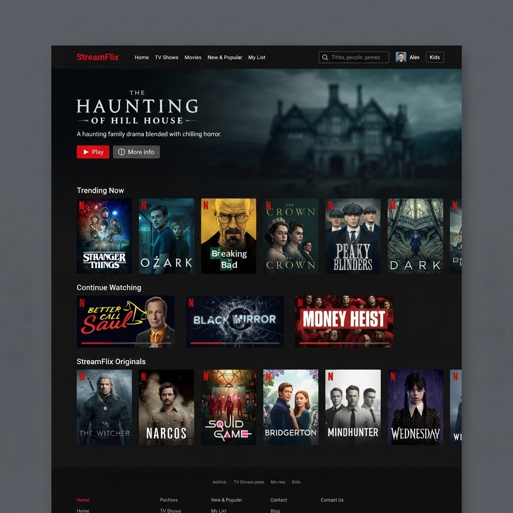
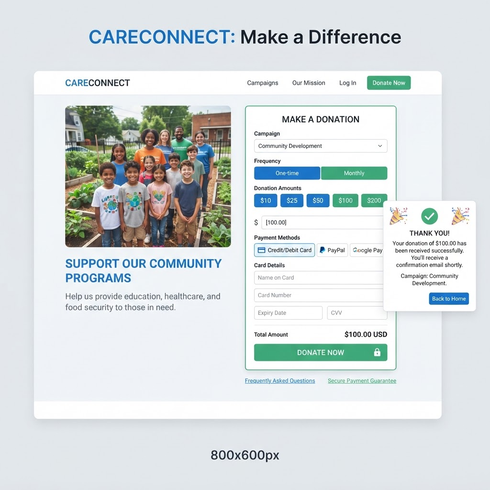
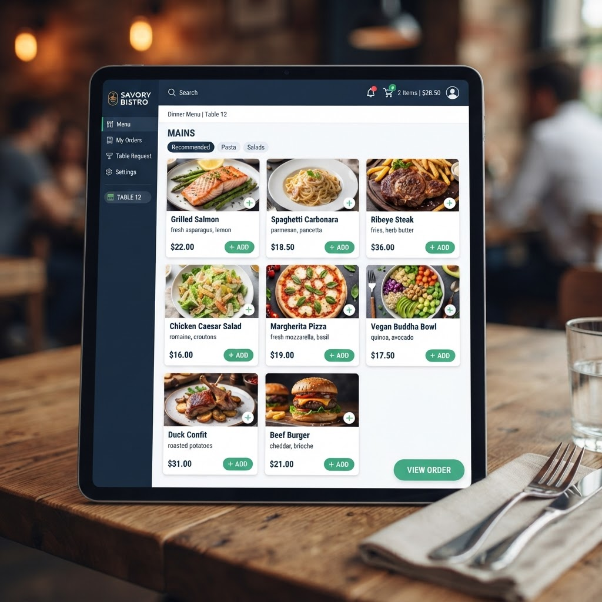

# Complete Guide: Images & References Locations

## 📸 Images Directory Structure

All images must go in this folder:
```
src/assets/images/
├── profile.png          ← Your profile photo
├── project1.png         ← Netflix Clone
├── project2.png         ← Donation App
└── project3.png         ← E-menu
```

## 🖼️ Profile Picture

### Location in HTML
```html
<!-- File: index.html, Line 50 -->

```

### How to Replace
1. Take a square photo (300x300px recommended)
2. Save it as `profile.png` in `src/assets/images/`
3. It will automatically display in the hero section

### Tips
- Use a professional headshot
- Ensure good lighting
- Crop to square format
- 300x300px is perfect, but any square size works

---

## 🎬 Project Images

### Project 1: Netflix Clone
**File Location**: `src/assets/images/project1.png`
**HTML Reference**: Line 96
**Size**: Recommend 800x600px

```html
<div class="project-image">
    
</div>
```

**How to Update**:
1. Take a screenshot of your Netflix Clone
2. Save as `project1.png` in `src/assets/images/`
3. Shows automatically on the portfolio

---

### Project 2: Donation App
**File Location**: `src/assets/images/project2.png`
**HTML Reference**: Line 122
**Size**: Recommend 800x600px

```html
<div class="project-image">
    
</div>
```

**How to Update**:
1. Take a screenshot of your Donation App
2. Save as `project2.png` in `src/assets/images/`
3. Shows automatically on the portfolio

---

### Project 3: E-menu
**File Location**: `src/assets/images/project3.png`
**HTML Reference**: Line 148
**Size**: Recommend 800x600px

```html
<div class="project-image">
    
</div>
```

**How to Update**:
1. Take a screenshot of your E-menu app
2. Save as `project3.png` in `src/assets/images/`
3. Shows automatically on the portfolio

---

## 🔗 Links & References Guide

### Where Project References Are

**File**: `index.html` (lines 100-170)

#### Project 1: Netflix Clone
```html
<!-- Description -->
<p class="project-description">
    A responsive Netflix-inspired streaming platform built with React, 
    featuring user authentication, movie browsing, and trailer previews. 
    Integrated Firebase for authentication and TMDB API for dynamic content.
</p>

<!-- GitHub Link - UPDATE THIS -->
<a href="https://github.com/dagiz6/netflix-clone" class="link-btn github-btn">
    GitHub
</a>

<!-- Live Demo Link - UPDATE THIS -->
<a href="https://netflix-clone-live.com" class="link-btn live-btn">
    Live
</a>
```

**What to Update**:
- Line 101: Update description text
- Line 108: Update GitHub URL
- Line 112: Update Live demo URL

---

#### Project 2: Donation App
```html
<!-- Description -->
<p class="project-description">
    A secure donation platform developed with React, allowing users 
    to contribute seamlessly via Chapa payment gateway. Features real-time 
    transaction tracking and a user-friendly UI.
</p>

<!-- GitHub Link - UPDATE THIS -->
<a href="https://github.com/dagiz6/donation-web-app" class="link-btn github-btn">
    GitHub
</a>

<!-- Live Demo Link - UPDATE THIS -->
<a href="https://donation-app-live.com" class="link-btn live-btn">
    Live
</a>
```

**What to Update**:
- Line 127: Update description text
- Line 134: Update GitHub URL
- Line 138: Update Live demo URL

---

#### Project 3: E-menu
```html
<!-- Description -->
<p class="project-description">
    A digital restaurant menu built with React, offering an interactive 
    interface for browsing food items. Includes category filtering, 
    and an elegant UI for seamless ordering experience.
</p>

<!-- GitHub Link - UPDATE THIS -->
<a href="https://github.com/dagiz6/E-menu" class="link-btn github-btn">
    GitHub
</a>

<!-- Live Demo Link - UPDATE THIS -->
<a href="https://emenu-live.com" class="link-btn live-btn">
    Live
</a>
```

**What to Update**:
- Line 153: Update description text
- Line 160: Update GitHub URL
- Line 164: Update Live demo URL

---

## 📝 Text Content Locations

### Hero Section (Top)
**File**: `index.html`, Lines 43-47

```html
<h1 class="hero-title">Hi, I'm <span class="highlight">Dagim Tamirat</span></h1>
<p class="hero-subtitle">Computer Science Graduate from Jimma University</p>
<p class="hero-description">
    Full-stack developer passionate about building modern web applications...
</p>
```

**Update**:
- Name (auto keeps "Dagim Tamirat")
- Subtitle (already says "Graduate from Jimma University")
- Description (customize your intro)

---

### About Section
**File**: `index.html`, Lines 63-68

```html
<p>
    I'm a Computer Science graduate from Jimma University with a passion 
    for creating impactful digital solutions...
</p>
<p>
    My journey in tech started with a curiosity about how things work...
</p>
```

**Update**:
- Add your personal story
- Describe your journey
- Highlight your achievements

---

### Skills Section
**File**: `index.html`, Lines 70-77

```html
<div class="skill-tag">JavaScript</div>
<div class="skill-tag">React</div>
<div class="skill-tag">Node.js</div>
<!-- ... etc -->
```

**Update**:
- Add/remove skills you have
- Keep only relevant technologies

---

## 📧 Contact Information

**File**: `index.html`, Lines 182-191

```html
<!-- Email -->
<a href="mailto:dagimt369@gmail.com" class="contact-link">
    📧 Email
</a>

<!-- LinkedIn -->
<a href="https://linkedin.com/in/dagiz6" class="contact-link" target="_blank">
    💼 LinkedIn
</a>

<!-- GitHub -->
<a href="https://github.com/dagiz6" class="contact-link" target="_blank">
    🐙 GitHub
</a>

<!-- Twitter -->
<a href="https://twitter.com/yourhandle" class="contact-link" target="_blank">
    𝕏 Twitter
</a>
```

**Update**:
- Email: dagimt369@gmail.com (already set)
- LinkedIn: https://linkedin.com/in/dagiz6 (already updated)
- GitHub: https://github.com/dagiz6 (already updated)
- Twitter: Replace `yourhandle` with your actual handle

---

## 🎨 How Project Images Display

Each project card has:
1. **Image** - Shows at the top
2. **Title** - Project name
3. **Description** - What it does
4. **Tags** - Technologies used
5. **Buttons** - GitHub & Live demo links

```
┌─────────────────────────┐
│   Project Image (800px) │
├─────────────────────────┤
│ Project Title           │
│                         │
│ Project Description     │
│ Lorem ipsum dolor...    │
│                         │
│ [Tag1] [Tag2] [Tag3]   │
│                         │
│ [🔗 GitHub] [🚀 Live]  │
└─────────────────────────┘
```

---

## ✅ Quick Checklist

### Images
- [ ] Add profile.png (300x300px, square)
- [ ] Add project1.png (800x600px recommended)
- [ ] Add project2.png (800x600px recommended)
- [ ] Add project3.png (800x600px recommended)
- [ ] All images in `src/assets/images/` folder

### Links
- [ ] Update project1 GitHub URL
- [ ] Update project1 Live demo URL
- [ ] Update project2 GitHub URL
- [ ] Update project2 Live demo URL
- [ ] Update project3 GitHub URL
- [ ] Update project3 Live demo URL
- [ ] Update Twitter handle in contact

### Text
- [ ] Update project1 description
- [ ] Update project2 description
- [ ] Update project3 description
- [ ] Update About Me section
- [ ] Update skills list
- [ ] Verify contact email

---

## 🚀 After Adding Images & References

1. Save all changes to `index.html`
2. Add/replace images in `src/assets/images/`
3. Open portfolio in browser to preview
4. Test dark/light theme toggle
5. Test all project links
6. Test contact links
7. Deploy to Vercel!

---

## 📸 Getting Screenshots of Your Projects

For each project:
1. Open the project in your browser
2. Take a full-page screenshot
3. Crop to 800x600px (or similar ratio)
4. Save as project1.png, project2.png, etc.
5. Place in `src/assets/images/`

**Tools**:
- Built-in screenshot tools
- Chrome DevTools (F12)
- Figma/Canva for editing
- Online image resizers

---

## 🎓 Portfolio Text Reference

The portfolio now correctly states:
> Computer Science Graduate from Jimma University

This is displayed in the hero section and emphasizes:
- ✅ Complete education status
- ✅ Institution name (Jimma University)
- ✅ Field (Computer Science)
- ✅ Professional presentation

---

**All set! Your portfolio is ready to shine.** 🌟
